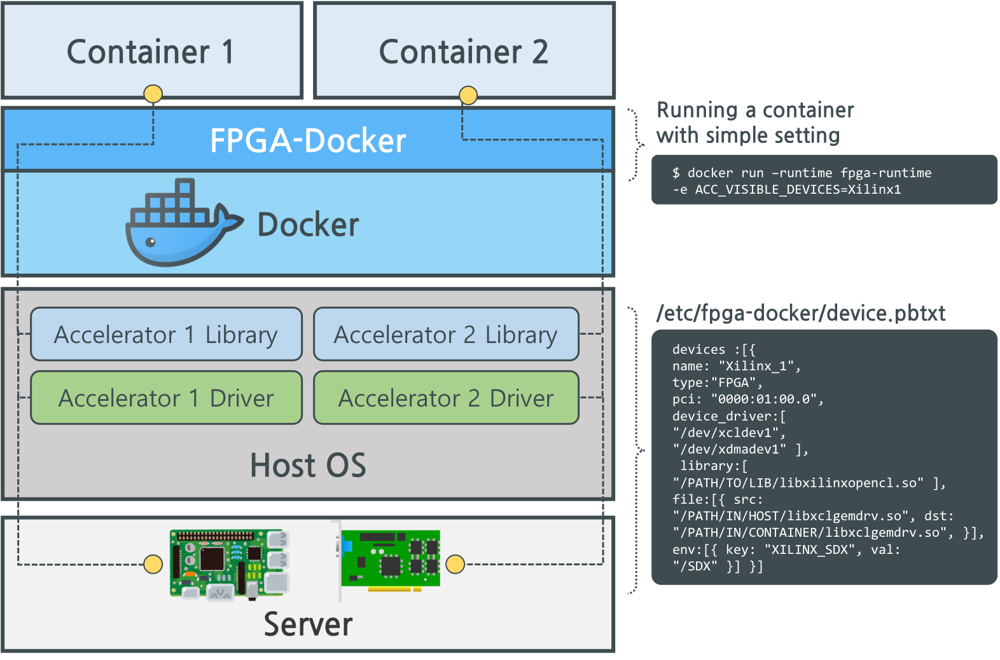

# Accelerator-Docker

Accelerator-Docker supports running container with accessibility to a target hardware accelerator (e.g., fpga or gpu).  
It can manage status of all accelerators in a server.
Accelerator-Docker supports automatic pass-through of PCIe-connected accelerators (FPGA or GPU) in container. Original docker requires setting for mounting device driver, libraries to access specific hardware in the container. In the Accelerator-Docker, however, it automatically runs a container following the pre-determined settings with simple option. Moreover, it provides common interface to manage heterogeneous accelerators. More details are described below.

<p align="center">
 
</p>

## Getting Started
#### Dependencies
- Docker
- Go >= 1.6
- Protocol Buffers (C++) & Protoc

For dependencies, refer to [Docker](https://docs.docker.com/install/linux/docker-ce/ubuntu/#set-up-the-repository), [Go](https://golang.org/dl/), [Protocol Buffers](https://github.com/protocolbuffers/protobuf/blob/master/src/README.md) 

#### Installing
Install dependencies for build
```bash
$ sudo apt-get update && \
  sudo apt-get install -y build-essential git pkg-config libseccomp-dev libcap-dev libpci-dev libapparmor-dev libselinux1-dev
```
Now, clone this repository and make it.
```bash
$ git clone https://github.com/KAIST-NCL/FPGA-Docker.git
$ cd FPGA-Docker
$ make
$ sudo make install
```

#### Tested Environment
- Ubuntu 16.04
- Docker 18.06.1-ce
- Go 1.11
- Protocol Buffers 3.6.1

## How to run Accelerator-Docker
First, you need to provide device list you want to access from docker container as protocol buffer text form.  
**/etc/accelerator-docker/device.pbtxt**
```
devices :[{
    name: "Xilinx_1",
    type:"FPGA",
    pci: "0000:01:00.0",
    device_driver:[
        "/dev/xcldev1",
        "/dev/xdmadev1"
    ],
    library:[
        "/PATH/TO/LIB/libxilinxopencl.so"
    ],
    file:[{
        src: "/PATH/IN/HOST/libxclgemdrv.so",
        dst: "/PATH/IN/CONTAINER/libxclgemdrv.so",
    }],
    env:[{
        key: "XILINX_SDX",
        val: "/SDX"
    }]
}]
```
(Files specified in 'library' section are mounted to '/usr/lib' of container, while the files specified in 'file' section are mounted to specific path.)

```
$ docker run --runtime fpga-runtime -e ACC_VISIBLE_DEVICES=Xilinx_1
```

## Using FPGA-Manager
Accelerator-Docker not only provides runtime hook for docker but also provides manager registered in device file.
Accelerator-Manager provides status for all devices and which container uses the hardware.

```
$ fpga-manager list
```


## Authors
#### KAIST NCL
* [Sunghyun Kim](https://github.com/cqbqdd11519)
* [Eunju Yang](https://github.com/EunjuYang)

## License
